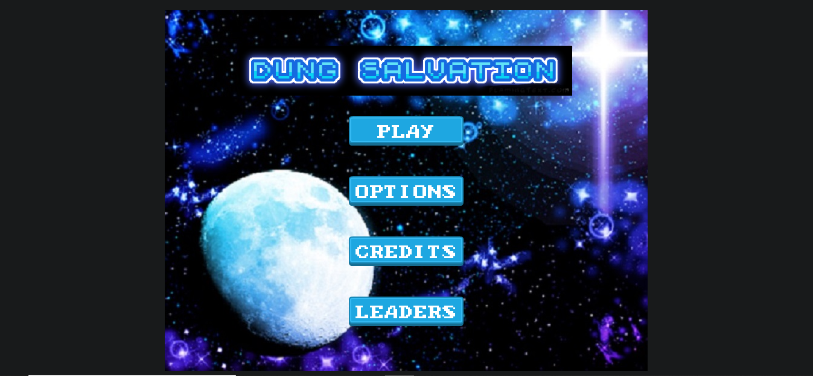
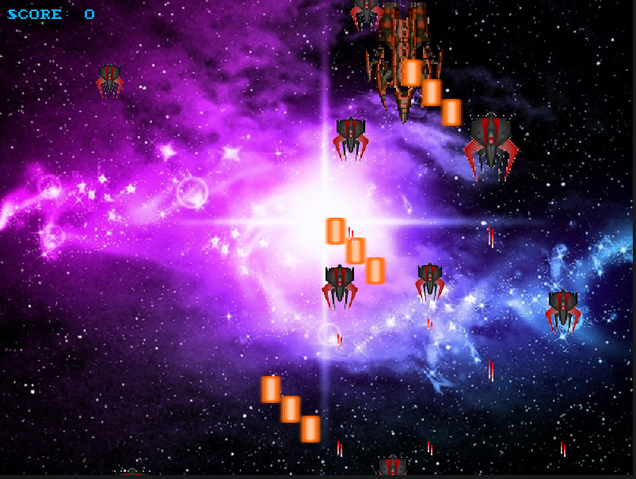
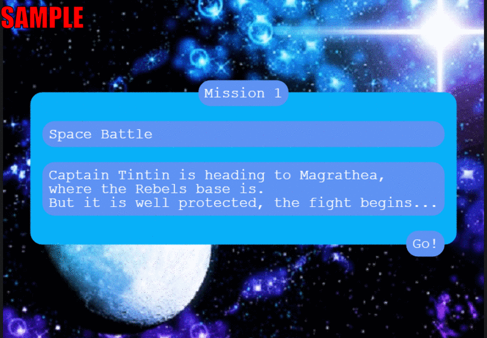

<!--
*** Thanks for checking out this README Template. If you have a suggestion that would
*** make this better, please fork the repo and create a pull request or simply open
*** an issue with the tag "enhancement".
*** Thanks again! Now go create something AMAZING! :D
-->

<!-- PROJECT SHIELDS -->
<!--
*** I'm using markdown "reference style" links for readability.
*** Reference links are enclosed in brackets [ ] instead of parentheses ( ).
*** See the bottom of this document for the declaration of the reference variables
*** for contributors-url, forks-url, etc. This is an optional, concise syntax you may use.
*** https://www.markdownguide.org/basic-syntax/#reference-style-links
-->
[![Contributors][contributors-shield]][contributors-url] 
[![Forks][forks-shield]][forks-url] 
[![Stargazers][stars-shield]][stars-url] 
[![Issues][issues-shield]][issues-url] 
 

# Dung-Salvation-Shooter-Game-JS

>  Shooter game built with Javascript using Phaser and Webpack. Capstone Project for Microverse on the top of my Javascript knowledge.

Landing Page:


First Stage:


Animated GIF:


## Game Design Document

Kindly check my Game Design Document [GDD](assets/docs/gamedesigndocument.md)

## Built With

- HTML 
- CSS
- JAVASCRIPT
- PHASER 3
- NPM
- WEBPACK
- EXPRESS
- BOOTSTRAP
- JEST
- GITHUB ACTIONS

## Live Demo

[Live Demo Link](https://javitocor.github.io/Dung-Salvation-Shooter-Game-JS/) :point_left:

## Instructions to Play

- Click the option you want in the Landing Scene.

- Press 'Play' to start playing.

- Press 'Options' to enable/disable sound features.

- Press 'Credits' to see who made it possible.

- Press 'Leaders' to see the 5 best scores.

- To play you need the Keyboard and the Mouse.

- CONTROLS:

  - Press 'A' to move LEFT.

  - Press 'D' to move RIGHT.

  - Press 'W' to move UP.

  - Press 'S' to move DOWN.

  - Press 'SpaceBar' to SHOOT.

- Use the mouse for the non-game and dialogues screens.

- ENJOY!


## Getting Started

### Usage

- Click the Live Demo link and enjoy playing Dung Salvation.

### Prerequisites

- A modern browser, up to date.  :muscle:

### Setup

- Clone the repository on your local machine
- Cd into the folder
- Run `npm install`
- Run `npm start`
- On your browser, make sure you point to the right address (i.e: http://localhost:8080/)

### Run tests

- Run ```npm test``` on the root directory to run all the tests.
- Run `npm test -- --verbose` on the root directory to run all the tests and see for what it is each test.
- Run ```npm test testfile.test.js ``` on root directory to run test for a single file.

## Future features

- Add extra stages, weapons and effects.
- Add more enemies
- Add images in the dialogues scenes
- Modify the assets
- Add animations
- Add a pause scene 

## Author

👤 Javier Oriol Correas Sanchez Cuesta 
- Github: [@javitocor](https://github.com/javitocor) 
- Twitter: [@JavierCorreas4](https://twitter.com/JavierCorreas4) 
- Linkedin: [Javier Oriol Correas Sanchez Cuesta](https://www.linkedin.com/in/javier-correas-sanchez-cuesta-15289482/) 

## 🤝 Contributing

Contributions, issues and feature requests are welcome!

Feel free to check the [issues page](https://github.com/javitocor/Dung-Salvation-Shooter-Game-JS/issues).

## Show your support

Give a ⭐️ if you like this project!

## Acknowledgments 🚀

- Phaser 3 docs
- StackOverFlow
- Microverse
- https://opengameart.org/

## 📝 License

This project is [MIT](lic.url) licensed.

<!-- MARKDOWN LINKS & IMAGES -->
<!-- https://www.markdownguide.org/basic-syntax/#reference-style-links -->
[contributors-shield]: https://img.shields.io/github/contributors/javitocor/Dung-Salvation-Shooter-Game-JS.svg?style=flat-square
[contributors-url]: https://github.com/javitocor/Dung-Salvation-Shooter-Game-JS/graphs/contributors
[forks-shield]: https://img.shields.io/github/forks/javitocor/Dung-Salvation-Shooter-Game-JS.svg?style=flat-square
[forks-url]: https://github.com/javitocor/Dung-Salvation-Shooter-Game-JS/network/members
[stars-shield]: https://img.shields.io/github/stars/javitocor/Dung-Salvation-Shooter-Game-JS.svg?style=flat-square
[stars-url]: https://github.com/javitocor/Dung-Salvation-Shooter-Game-JS/stargazers
[issues-shield]: https://img.shields.io/github/issues/javitocor/Dung-Salvation-Shooter-Game-JS.svg?style=flat-square
[issues-url]: https://github.com/javitocor/Dung-Salvation-Shooter-Game-JS/issues